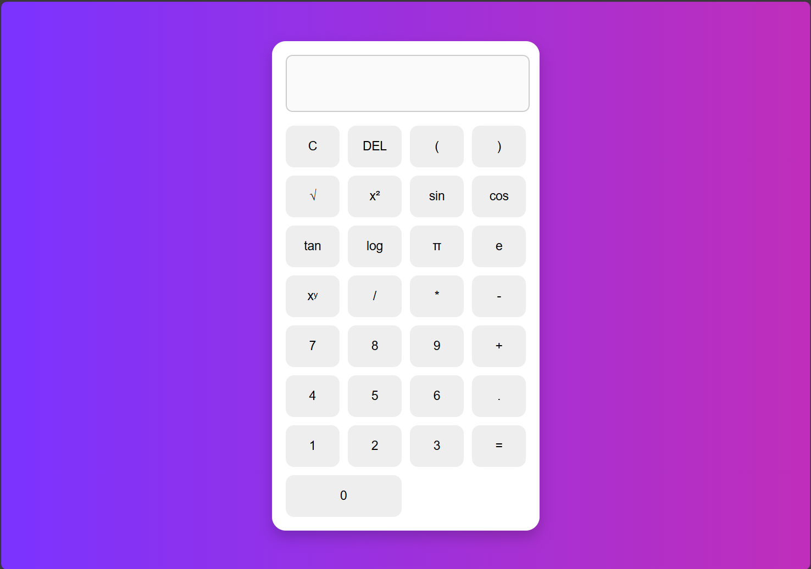

# 🔬 Scientific Calculator

A simple and responsive **Scientific Calculator** built using **HTML**, **CSS**, and **JavaScript**.  
This calculator enables users to perform basic arithmetic operations, as well as scientific calculations such as square roots, trigonometric functions, logarithms, and powers.

---

## 📸 Preview

 <!-- Add a screenshot here if available -->

---

## ✨ Features

- Basic operations: Addition, Subtraction, Multiplication, Division
- Scientific functions:  
  - Square root (√)  
  - Power (xʸ)  
  - Square (x²)  
  - π (Pi) and **e** constants  
  - Trigonometric functions: sin, cos, tan  
  - Logarithm (base 10)  
- Delete (DEL) and Clear (C) functionality
- Responsive and user-friendly design
- Real-time expression evaluation with error handling

---

## 🚀 Technologies Used

- **HTML5** – Structure of the calculator  
- **CSS3** – Styling and layout  
- **JavaScript (Vanilla)** – Functionality and logic

---
